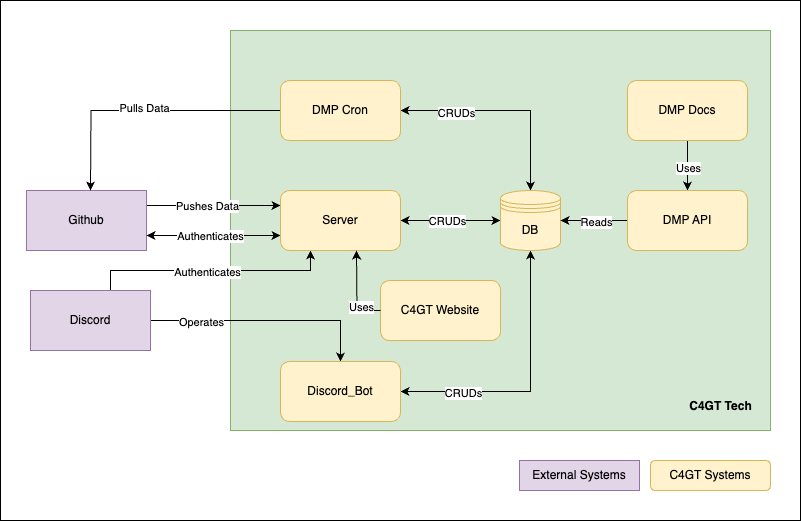

<head>
  <title>C4GT Docs</title>
  <meta
    name="description"
    content="Documentation of the C4GT Tech Products"
  />

  <meta property="og:url" content="https://c4gt-docs.netlify.app/" />
</head>

## Overview

Launched in 2022, C4GT is a one-of-its-kind initiative that aims to build a community of communities
around Digital Public Goods (DPG), Digital Public Infrastructure (DPI) & Tech for Good products.
Through various efforts, it aims to encourage ongoing contributions and strengthen collaboration
between DPG/DPI builders, adopters, and contributors (students or working professionals). The
initiative works towards facilitating long-term collaboration and innovation within the fast
evolving DPGs/DPI & Tech for Good ecosystem, enhancing the efficiency and quality of contributions,
and aligning the incentives for both organizations and contributors.
More about C4GT here: https://codeforgovtech.in/

## This Website Audience

This website tries to document the tech systems powering the C4GT initiatives. If you are a product
manager, community manager or a software engineer, wanting to understand how to build a system that
integrates multiple tools used by open source developers together, this is the right place for you.

## Architecture

[Source](https://drive.google.com/file/d/1hzB6voh36gB87t9LrPLWLlBboRl2bziM/view?usp=sharing)

* **GitHub and Discord** - We listen to events from external systems like GitHub and Discord. These
  could be joining a discord server, sending a message in a discord channel, joining a discord
  channel, logging into a github app, commenting on a github issue, raising a PR and so on. Both
  these external systems are commonly used in the tech ecosystem to manage open source software and
  contributions.
* **DMP Cron** - We run a
  yearly [Dedicated Mentorship Program (DMP)](https://codeforgovtech.in/dedicated_mentoring_program/)
  initiative. This module pulls data from Github related to that.
* **Server** - This module is responsible to power authentication across GitHub and Discord for our
  members. It also manager
  the [Open Community](https://codeforgovtech.in/community-program-projects/) tickets raised &
  closed in the community.
* **C4GT website** - The website uses elements from server to render itself.
* **Discord Bot** - The custom flows of [our discord server](https://discord.gg/V3Aa9qk4Wt) are
  controlled by this module. A major flow is connecting discord users to github users.
* **DB** - All modules have a single source of truth and database.
* **DMP API** - This flask module powers the DMP docs website APIs.
* **DMP Docs** - This docusaurus module powers https://milestones.c4gt.samagra.io/.