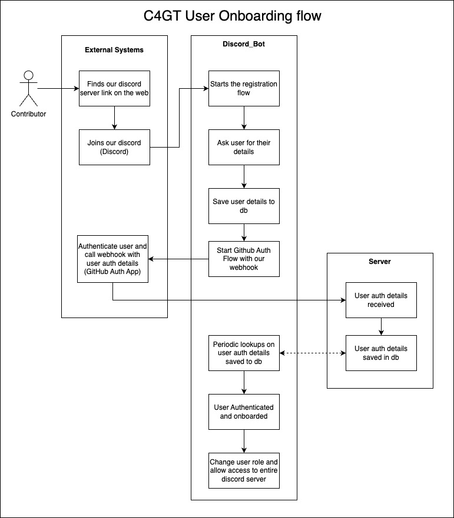

<head>
  <title>C4GT - Onboarding</title>
 </head>

## Goal

The C4GT onboarding flow provides a seamless experience for contributors joining the C4GT community,
enabling personalized interactions that enhance their journey within the community

## Product

### Discovering C4GT:

The user learns about C4GT through various channels (social media, word-of-mouth, or invitations)
and accesses a shared link to join the community.

### Joining the Discord Server:

The user is redirected to C4GT’s Discord server, where they begin the onboarding process.
Upon joining, the user is prompted to answer a few introductory questions, such as gender, location,
and educational institution.

### Exploring the Server Guide:

After completing the initial questions, the user is guided to the Server Guide channel.
This channel provides an overview of the onboarding steps, community guidelines, and a snapshot of
C4GT initiatives and opportunities.

### Linking GitHub with Discord:

To streamline contributions, the user is prompted to link their GitHub account with their Discord
profile using C4GT’s dedicated Discord bot.

### Introducing Themselves:

The user is encouraged to introduce themselves to the community by sharing details about their
interests, skills, and goals.
During this step, they also acknowledge and accept the community’s Code of Conduct.

### Completing Onboarding:

Once all steps are completed, the user is fully onboarded and they can now start contributing to
projects, participating in discussions, and exploring community initiatives.

## Tech

Open source contributions primarily happen over Github. Our tech system allows us to connect
accounts across Discord (our community management platform) & GitHub. To be able to link both the
platforms together for a particular user we have built the onboarding flow.

[Source](https://drive.google.com/file/d/1hzB6voh36gB87t9LrPLWLlBboRl2bziM/view?usp=sharing)
